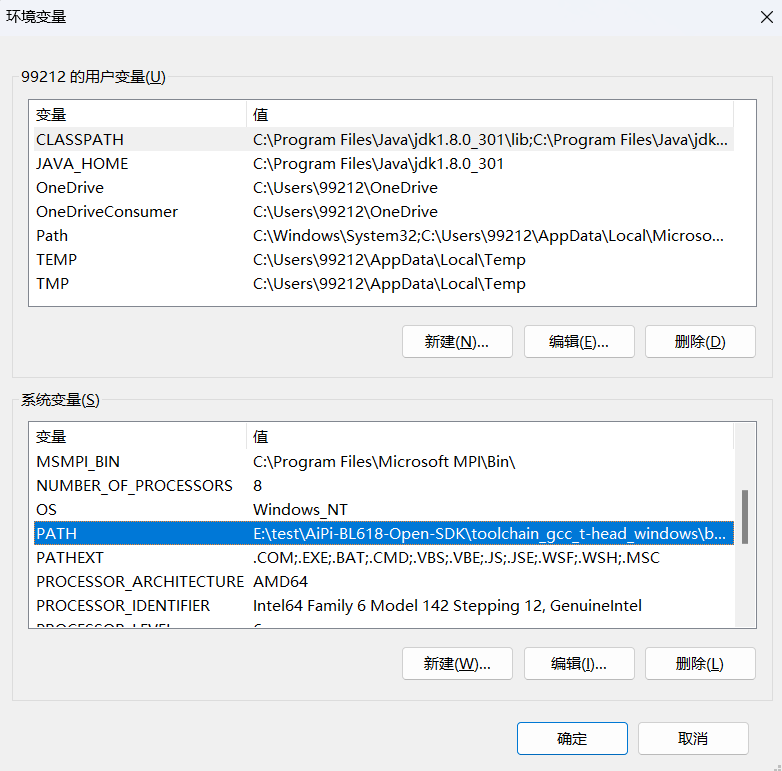

#AiPi-CAM-D200

# 前言
本工程包含博流Github开源的整个SDK，默认为windows环境以满足大众需求

# 克隆项目
确保拥有git工具，在对应文件夹下Git Bush Here，git clone 下来整个项目（默认的编译工具链已经设置为子模块，之前拉取过其它版本SDK则只需进行到这一步后进行工程移植）

# 以下步骤适用于初次搭建环境的朋友
## 进入工程
cd AiPi-BL618-Open-SDK

## 初始化子模块
git submodule init

## 拉取子模块
git submodule update
该子模块为windows的riscv编译工具链，链接为gitee

# 设置环境变量（以win11为例）
## 系统——>高级系统设置

## 点击环境变量

## 点击系统变量下的PATH

## 新建环境变量，工程路径下这三个环境变量

## 设置完记得重启电脑

## 重启完验证是否成功设置
在桌面按住 shift 键点击 鼠标右键 打开 PowerShell 。在 PowerShell 输入：
make -v

 riscv64-unknown-elf-gcc -v

## 使用VSCODE打开工程并编译

在D200工程下输入make进行编译

编译成功如下

## 烧录
make flash COMX=COM14（设备管理器自行查看对应COM口）

注意进入烧录模式，长按Burn（S2）不松手，短按一下RST（S1）后，再松开Burn。

烧录成功后，合成的固件在bouffalo_sdk\tools\bflb_tools\bouffalo_flash_cube\chips\bl616\img_create\whole_flash_data.bin下，可使用工具烧录，也可以如上使用命令行烧录